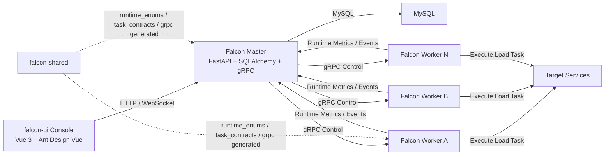
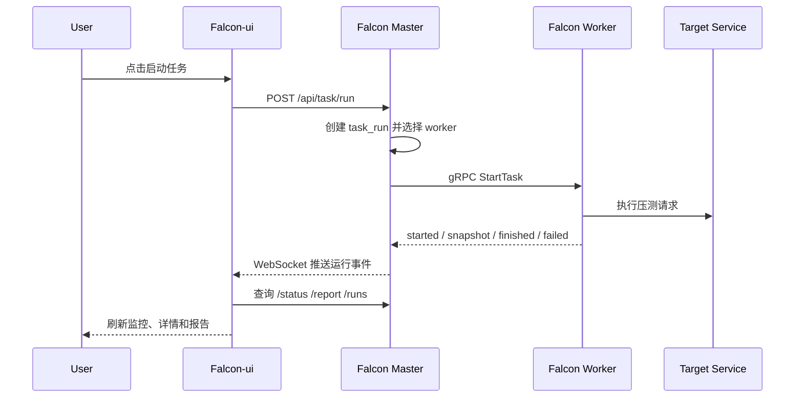
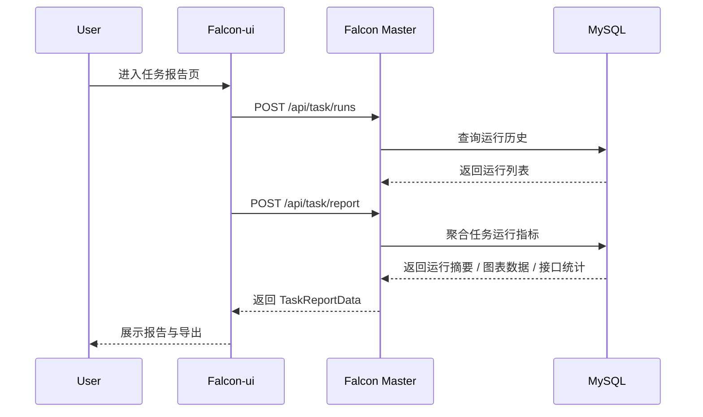

# Falcon

Falcon 是一个面向压测任务编排、分布式执行、实时监控与报告分析的一体化平台。项目当前已经覆盖任务编排、场景与用例管理、实时监控、运行报告、任务详情分析、控制台首页和 Worker 管理等主链路能力。

## 1. 项目介绍

Falcon 采用 `控制面 + 执行节点 + 前端控制台` 的整体架构：

- 前端负责任务管理、监控、报告、详情分析和控制台展示
- `falcon-master` 负责鉴权、任务编排、运行态聚合、Dashboard 聚合和 gRPC 控制面
- `falcon-worker` 负责接收任务、执行压测、回传事件、上报节点资源数据
- `falcon-shared` 提供 Master / Worker 之间共享的运行时枚举、任务契约和 gRPC generated 协议层

技术栈概览：

- 前端：Vue 3 + Vite + Pinia + Ant Design Vue + ECharts
- Master：FastAPI + SQLAlchemy + Alembic + MySQL + JWT + gRPC
- Worker：Python + gRPC + engine_v2 + 节点资源采样
- Shared：Pydantic + gRPC generated + 共享契约

## 2. 功能列表

### 2.1 平台基础能力

- 用户、项目、场景、用例、任务管理
- 项目级权限控制
- Dashboard 控制台首页
- Worker 注册、心跳、筛选、状态管理
- 统一日志、请求上下文、响应包装

### 2.2 任务链路能力

- 创建和编辑任务
- 为任务绑定场景与场景权重
- 启动任务
- 停止任务
- 查询任务运行状态
- 查询任务运行历史
- 生成任务单次运行报告

### 2.3 任务监控页面

- WebSocket + HTTP 混合实时链路
- 运行总览指标卡
- 在线用户、吞吐、响应时间、失败趋势
- 智能诊断面板
- 热点接口分析
- 错误摘要与接口统计
- Worker / 主机性能吸底条

### 2.4 任务详情页面

- 任务基础信息
- 场景编排与用例结构
- 任务运行记录列表
- 单次运行摘要
- 双运行差异分析
- 多次运行趋势
- 规则化洞察

### 2.5 任务报告页面

- 单次运行基础信息
- 运行总览指标
- 在线用户、吞吐、响应时间、失败趋势
- 热点接口与风险接口
- 状态码分布、错误类型分布
- 失败样本
- 接口统计明细
- CSV / JSON / PDF 导出

### 2.6 控制台首页

- 平台总览卡
- 运行中任务
- 重点关注任务
- 最近运行记录
- Worker 状态概览
- 趋势图与平台告警摘要

## 3. 页面职责划分

- 控制台首页：平台态势、重点任务、告警、快捷入口
- 任务详情页：任务定义、场景用例、历史运行、对比分析、趋势洞察
- 任务监控页：某次运行的实时状态、趋势和实时性能
- 任务报告页：某次运行的完整结果汇总与导出

## 4. 架构图



## 5. 核心时序图

### 5.1 启动任务



### 5.2 查看报告



## 6. 项目结构

```text
Falcon/
├── falcon-master/                 # 控制面服务
│   ├── app/
│   │   ├── api/                   # HTTP / WebSocket 接口
│   │   ├── core/                  # 配置、日志、异常、安全
│   │   ├── grpc_master/           # gRPC control plane
│   │   ├── middleware/            # 认证、请求上下文、响应包装
│   │   ├── models/                # SQLAlchemy 模型
│   │   ├── schemas/               # Pydantic Schema
│   │   ├── services/              # 任务、报告、Worker、Dashboard 服务
│   │   └── utils/                 # 通用工具
│   ├── alembic/                   # 数据库迁移
│   ├── main.py                    # Master 启动入口
│   ├── manage.py
│   └── requirements.txt
├── falcon-worker/                 # Worker 执行节点
│   ├── app/
│   │   ├── engine_v2/             # 执行引擎
│   │   ├── control_plane_client.py
│   │   ├── control_plane_reporter.py
│   │   ├── grpc_task_runner.py
│   │   ├── logging_config.py
│   │   ├── settings.py
│   │   ├── worker_resource_snapshot.py
│   │   ├── worker_runtime_service.py
│   │   └── worker_server.py
│   ├── worker.py                  # Worker 启动入口
│   ├── requirements.txt
│   └── .env.worker.example
├── falcon-shared/                 # 共享契约层
│   ├── falcon_shared/
│   │   ├── grpc/generated/        # gRPC pb2 / pb2_grpc
│   │   ├── runtime_enums.py       # 共享状态枚举
│   │   └── task_contracts.py      # 共享任务契约
│   ├── proto/worker_runtime.proto
│   ├── pyproject.toml
│   └── requirements.txt
├── falcon-ui/                      # 前端控制台
│   ├── src/
│   │   ├── api/
│   │   ├── layout/
│   │   ├── router/
│   │   ├── store/
│   │   ├── types/
│   │   ├── utils/
│   │   └── views/
│   ├── package.json
│   └── vite.config.ts
├── deploy/                        # 部署文件
│   ├── falcon-master.Dockerfile
│   ├── falcon-worker.Dockerfile
│   ├── docker-compose.yml
│   ├── .env.master.example
│   ├── .env.worker.example
│   └── README.md
├── docs/
│   ├── distributed-engine-design.md
│   └── grpc-worker-runbook.md
└── README.md
```

## 7. 关键路由与页面

### 7.1 前端页面

- `/dashboard`：控制台首页
- 
- `/project`：项目管理
- 
- `/case`：用例管理
- 
- `/scenario`：场景管理
- 
- `/task`：任务管理
- 
- `/task/detail/:taskId`：任务详情页
- 
- `/task/detail/:taskId`：任务详情页-运行差异分析
- 
- `/monitor/:taskId`：任务监控页
- 
- `/report/:taskId`：任务报告页
- 
- `/system`：系统页 / Worker 管理
- 

### 7.2 后端核心接口

- `/api/task/list`
- `/api/task/info`
- `/api/task/create`
- `/api/task/update`
- `/api/task/run`
- `/api/task/stop`
- `/api/task/status`
- `/api/task/runs`
- `/api/task/report`
- `/api/dashboard/overview`
- `/api/worker/list`
- `/api/worker/info`
- `/api/worker/update`

## 8. 环境要求

### 8.1 后端

- Python 3.11+
- MySQL 8+
- Docker / Docker Compose（可选）

### 8.2 前端

- Node.js 18+
- pnpm

## 9. 安装与部署

### 9.1 克隆项目

```bash
git clone <your-repo-url>
cd Falcon
```

### 9.2 安装 falcon-shared

```bash
cd falcon-shared
python -m pip install -e .
```

### 9.3 安装 falcon-master 依赖

```bash
cd falcon-master
python -m venv .venv
.venv\Scripts\activate
pip install -r requirements.txt
pip install -e ..\falcon-shared
```

### 9.4 安装 falcon-worker 依赖

```bash
cd falcon-worker
python -m venv .venv
.venv\Scripts\activate
pip install -r requirements.txt
pip install -e ..\falcon-shared
```

### 9.5 安装前端依赖

```bash
cd falcon-ui
pnpm install
```

### 9.6 配置环境变量

Master：

```bash
cd falcon-master
copy .env.example .env
```

Worker：

```bash
cd falcon-worker
copy .env.worker.example .env.worker
```

容器部署可直接使用：

- `deploy/.env.master.example`
- `deploy/.env.worker.example`

## 10. 数据库初始化

```bash
cd falcon-master
alembic upgrade head
```

## 11. 运行方式

### 11.1 启动 falcon-master

```bash
cd falcon-master
.venv\Scripts\activate
python main.py
```

默认端口：

- HTTP: `127.0.0.1:8008`
- gRPC Master: `127.0.0.1:50051`

### 11.2 启动 falcon-worker

```bash
cd falcon-worker
.venv\Scripts\activate
python worker.py --env-file .env.worker
```

默认端口：

- Worker ID: `worker-local`
- Worker gRPC: `127.0.0.1:50061`

### 11.3 启动前端

```bash
cd falcon-ui
pnpm dev
```

默认访问地址：

- falcon-ui: `http://127.0.0.1:5173`

## 12. 常用命令

### 12.1 falcon-master

```bash
cd falcon-master
python main.py
alembic upgrade head
```

### 12.2 falcon-worker

```bash
cd falcon-worker
python worker.py --env-file .env.worker
```

### 12.3 falcon-ui

```bash
cd falcon-ui
pnpm dev
pnpm build
pnpm typecheck
```

## 13. 测试

当前测试主要集中在运行链路与运行态事件处理，建议在 `falcon-master` 中执行：

```bash
cd falcon-master
pytest tests/engine_v2 -q
```

重点覆盖：

- `engine_v2`
- `task_runtime_service`
- `grpc_runtime_event_service`
- 运行状态与报告聚合

## 14. 当前实现重点

### 14.1 falcon-master

- 任务状态机已统一为 `pending / running / stopping / completed / failed / canceled`
- 控制台首页已接入聚合接口 `/api/dashboard/overview`
- 任务详情、监控、报告三条主链路已经打通
- 运行态支持 `worker_snapshot`
- gRPC 控制面与 Worker 注册/心跳/派发链路已稳定运行

### 14.2 falcon-worker

- 独立 `settings.py` 与 `logging_config.py`
- 独立启动入口 `worker.py`
- 独立资源采样 `worker_resource_snapshot.py`
- 支持任务运行、停止、优雅退出

### 14.3 falcon-ui

- 监控页已重构为运行态工作台
- 任务详情页支持场景、用例、历史、对比与趋势
- 报告页支持 PDF 导出
- 控制台首页已接入真实聚合数据

## 15. 后续建议

- 继续收敛 `falcon-master / falcon-worker / falcon-shared` 之间的 import 边界
- 将 gRPC generated 完全沉到 `falcon-shared`
- 为控制台和任务运行链补更多自动化测试
- 为 Worker 中断恢复补完整状态收敛与恢复机制

## 16. 文档

- [分布式压测引擎设计](./docs/distributed-engine-design.md)
- [gRPC Worker 运行说明](./docs/grpc-worker-runbook.md)

## 17. 三目录独立部署

当前仓库已经按以下三目录拆分：

- `falcon-master`
- `falcon-worker`
- `falcon-shared`

其中：

- `falcon-master`：控制面、API、数据库、任务编排、报告聚合
- `falcon-worker`：执行节点、资源采样、gRPC Worker 服务
- `falcon-shared`：共享枚举、任务契约、gRPC generated

## 18. Docker 部署

`deploy/` 目录已经提供基于新结构的部署文件：

- `deploy/falcon-master.Dockerfile`
- `deploy/falcon-worker.Dockerfile`
- `deploy/docker-compose.yml`
- `deploy/.env.master.example`
- `deploy/.env.worker.example`
- `deploy/README.md`

### 18.1 启动方式

```bash
copy deploy\.env.master.example deploy\.env.master
copy deploy\.env.worker.example deploy\.env.worker
docker compose -f .\deploy\docker-compose.yml up --build -d
```

### 18.2 首次迁移

```bash
docker exec -it falcon-master alembic upgrade head
```

### 18.3 默认容器端口

- `8008`：Master HTTP API
- `50051`：Master gRPC
- `50061`：Worker gRPC
- `3306`：MySQL
