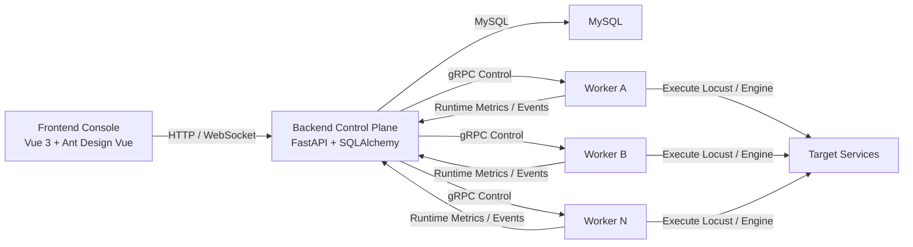
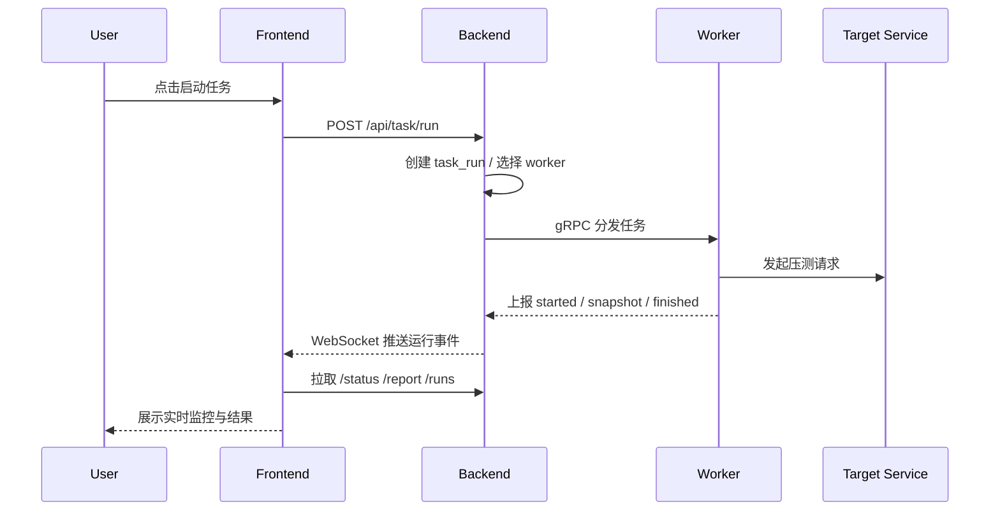
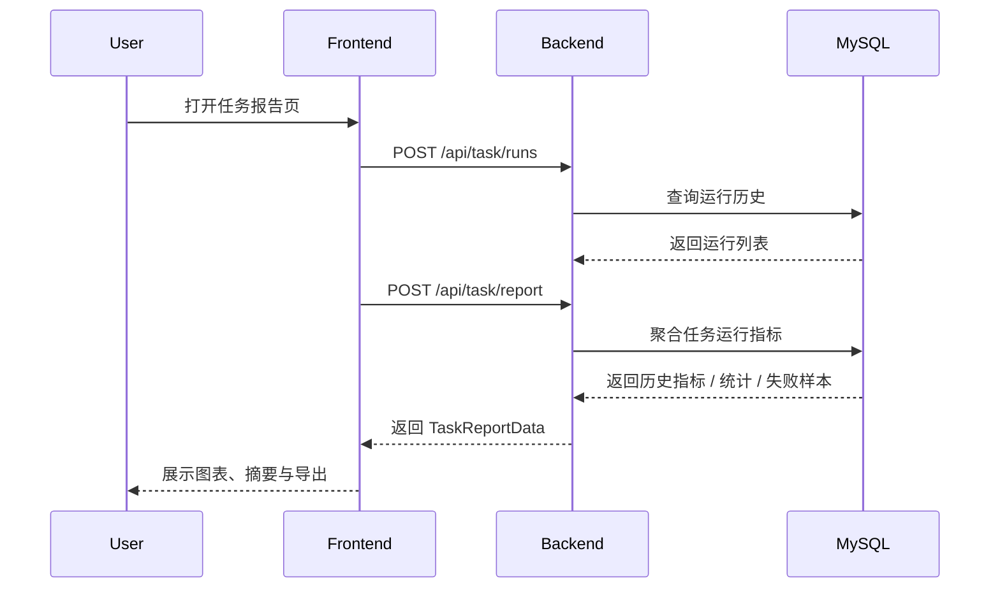

# Falcon

Falcon 是一个面向接口压测与分布式执行的压测平台，包含前端管理台、后端控制面以及 gRPC Worker 执行节点。  
项目当前已经覆盖了任务编排、场景与用例管理、实时监控、运行报告、任务详情分析、控制台首页和 Worker 管理等主链路能力。

## 1. 项目介绍

Falcon 的目标不是只做一个“能跑压测”的脚本工具，而是提供一套完整的压测工作台：

- 前端负责任务管理、监控、报告、控制台和系统管理
- 后端负责鉴权、配置管理、任务编排、运行态聚合和 gRPC 控制面
- Worker 负责执行实际压测任务、上报运行指标和节点资源数据

当前技术路线：

- 前端：Vue 3 + Vite + Pinia + Ant Design Vue + ECharts
- 后端：FastAPI + SQLAlchemy + Alembic + MySQL + JWT
- 执行与控制：Locust + gRPC + 自研控制面/Worker 机制

## 2. 功能列表

### 2.1 平台基础能力

- 用户登录、鉴权、基础权限控制
- 项目管理
- 用例管理
- 场景管理
- 任务管理
- Worker 管理
- 系统配置管理

### 2.2 任务链路能力

- 创建任务并绑定场景
- 场景下挂载多个用例并支持顺序/权重配置
- 启动任务
- 停止任务
- 查询任务实时状态
- 查询任务运行历史
- 生成任务单次运行报告

### 2.3 任务监控页面

- WebSocket 实时监控
- 断线自动轮询兜底
- 任务切换时重置旧状态
- 顶部控制栏
- 左侧任务信息悬浮窗
- 底部实时性能吸底条
- 运行总览指标卡
- 趋势图
- 热点接口分析
- 智能诊断区
- Worker / 主机实时性能承载位

### 2.4 任务详情页面

- 独立任务详情页
- 任务基础信息展示
- 场景与用例结构展示
- 任务运行记录列表
- 单次运行摘要
- 双运行差异分析
- 多次运行趋势
- 规则化洞察分析

### 2.5 任务报告页面

- 单次运行基础信息
- 运行总览指标
- 在线用户趋势图
- 吞吐趋势图
- 响应时间趋势图
- 失败趋势图
- 状态码分布
- 错误类型分布
- 热点接口与风险接口
- 失败样本
- 接口统计明细
- CSV / JSON 导出
- PDF 文件导出

### 2.6 控制台首页

- 平台总览卡
- 运行中任务
- 需要关注的任务
- 最近运行记录
- Worker 状态
- 今日趋势
- 平台告警摘要
- 首页到任务页 / 系统页 / 监控页 / 报告页的钻取跳转


## 3. 页面职责划分

- 控制台首页：平台态势、重点任务、告警与快捷入口
- 任务详情页：任务定义、场景/用例结构、历史与对比分析
- 任务监控页：某次运行的实时状态、趋势和实时性能
- 任务报告页：某次运行的完整结果汇总与导出

## 4. 架构图



## 5. 核心时序图

### 5.1 启动任务



### 5.2 查看报告



## 6. 项目结构

```text
Falcon/
├─ backend/
│  ├─ app/
│  │  ├─ api/              # HTTP / WebSocket 路由
│  │  ├─ core/             # 配置、日志、响应封装
│  │  ├─ grpc/             # gRPC 控制面
│  │  ├─ middleware/       # 鉴权、请求上下文、中间件
│  │  ├─ models/           # 数据模型
│  │  ├─ schemas/          # Pydantic Schema
│  │  ├─ services/         # 业务服务层
│  │  ├─ worker/           # Worker 侧逻辑
│  │  ├─ engine_v2/        # 执行引擎相关逻辑
│  │  └─ utils/            # 通用工具
│  ├─ alembic/             # 数据库迁移
│  ├─ proto/               # gRPC proto
│  ├─ tests/               # 后端测试
│  ├─ main.py              # 后端 HTTP + gRPC 入口
│  └─ worker.py            # Worker 启动入口
├─ frontend/
│  ├─ src/
│  │  ├─ api/              # 前端接口封装
│  │  ├─ components/       # 通用组件
│  │  ├─ layout/           # 布局与监控页组件
│  │  ├─ router/           # 路由
│  │  ├─ store/            # Pinia Store
│  │  ├─ types/            # TS 类型定义
│  │  ├─ utils/            # 工具函数
│  │  └─ views/            # 页面
│  ├─ package.json
│  └─ vite.config.ts
├─ docs/
│  ├─ distributed-engine-design.md
│  └─ grpc-worker-runbook.md
└─ README.md
```

## 7. 关键路由与页面

### 7.1 前端页面

- `/dashboard`：控制台首页
- 
- `/project`：项目管理
- 
- `/csse`：用例管理
- 
- `/scenario`：场景管理
- 
- `/task`：任务管理
- 
- `/task/detail/:taskId`：任务详情页
- 
- `/task/detail/:taskId`：任务详情页-运行差异分析
- 
- `/monitor/:taskId`：任务监控页
- 
- `/report/:taskId`：任务报告页
- 
- `/system`：系统与 Worker 管理
- 

### 7.2 后端核心接口

- `/api/task/list`
- `/api/task/info`
- `/api/task/create`
- `/api/task/update`
- `/api/task/run`
- `/api/task/stop`
- `/api/task/status`
- `/api/task/runs`
- `/api/task/report`
- `/api/dashboard/overview`
- `/api/worker/list`
- `/api/worker/info`
- `/api/worker/update`

## 8. 环境要求

### 8.1 后端

- Python 3.11+
- MySQL 8+

### 8.2 前端

- Node.js 18+
- pnpm

## 9. 安装与部署

### 9.1 克隆项目

```bash
git clone <your-repo-url>
cd Falcon
```

### 9.2 安装后端依赖

```bash
cd backend
python -m venv .venv
.venv\Scripts\activate
pip install -r requirements.txt
```

### 9.3 安装前端依赖

```bash
cd frontend
pnpm install
```

### 9.4 配置环境变量

后端建议复制：

```bash
cd backend
copy .env.example .env
copy .env.worker.example .env.worker
```

需要重点确认的配置项：

- `HOST`
- `PORT`
- `GRPC_MASTER_HOST`
- `GRPC_MASTER_PORT`
- `GRPC_WORKERS`
- `WORKER_SHARED_TOKEN`
- `DATABASE_URL`
- `SECRET_KEY`
- `REFRESH_SECRET_KEY`

## 10. 数据库初始化

执行 Alembic 迁移：

```bash
cd backend
alembic upgrade head
```

如果后续新增枚举或表结构，请继续通过 Alembic 迁移保持数据库一致。

## 11. 运行方式

### 11.1 启动后端

```bash
cd backend
.venv\Scripts\activate
python main.py
```

默认端口：

- HTTP: `127.0.0.1:8008`
- gRPC Master: `127.0.0.1:50051`

### 11.2 启动 Worker

```bash
cd backend
.venv\Scripts\activate
python worker.py --env-file .env.worker
```

默认本地 Worker 示例：

- Worker ID: `worker-local`
- Worker gRPC: `127.0.0.1:50061`

### 11.3 启动前端

```bash
cd frontend
pnpm dev
```

默认开发地址通常为：

- Frontend: `http://127.0.0.1:5173`

## 12. 常用命令

### 12.1 前端

```bash
cd frontend
pnpm dev
pnpm build
pnpm typecheck
```

### 12.2 后端

```bash
cd backend
python main.py
python worker.py --env-file .env.worker
alembic upgrade head
pytest tests/engine_v2 -q
```

## 13. 测试

当前仓库已有一批后端测试，主要集中在：

- `engine_v2`
- `task_runtime_service`
- `grpc_runtime_event_service`
- 本地指标聚合

测试目录：

- [backend/tests/engine_v2](/E:/pycharmProject/Falcon/backend/tests/engine_v2)

## 14. 当前实现重点

### 14.1 后端

- 任务状态已统一为 `pending / running / stopping / completed / failed / canceled`
- 已支持 `worker_snapshot`
- 控制台首页已改为后端单聚合接口
- 控制台聚合查询已过滤软删除数据

### 14.2 前端

- 监控页已重构为更明确的运行态工作台
- 任务详情页已独立
- 报告页已支持 PDF 导出
- 控制台首页已完成第一阶段、第二阶段和部分第三阶段

## 15. 后续建议

- 为控制台补充更多可点击钻取
- 补首页更多趋势维度
- 增加 dashboard 接口测试
- 增加前端类型检查与构建验证链路
- 继续清理历史乱码文案与旧页面遗留代码

## 16. 文档

- [分布式引擎设计](./docs/distributed-engine-design.md)
- [gRPC Worker 运行说明](./docs/grpc-worker-runbook.md)

---

如果你想了解这个项目，建议优先阅读：

1. 控制台首页
~~2. 任务详情页
3. 任务监控页
4. 任务报告页
5. `backend/app/services/task_runtime_service.py`
6. `backend/app/services/dashboard_service.py`~~
