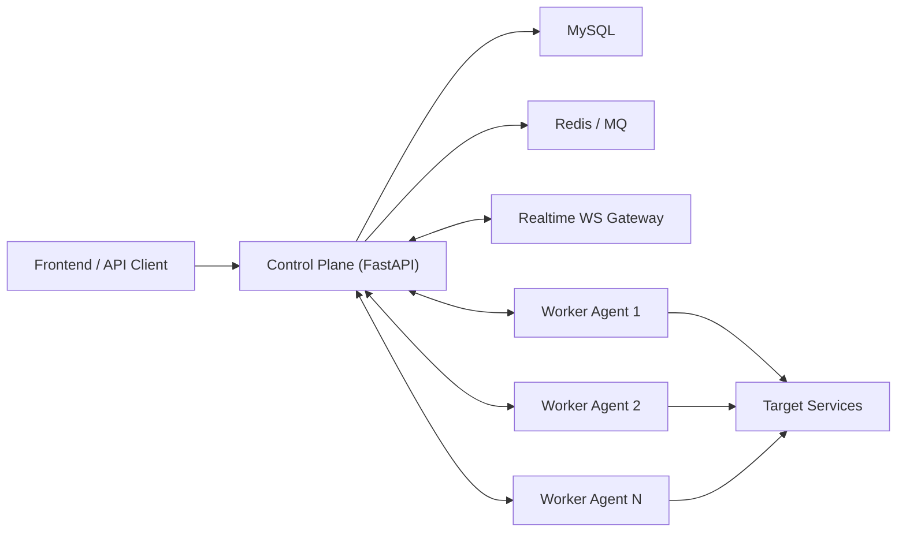
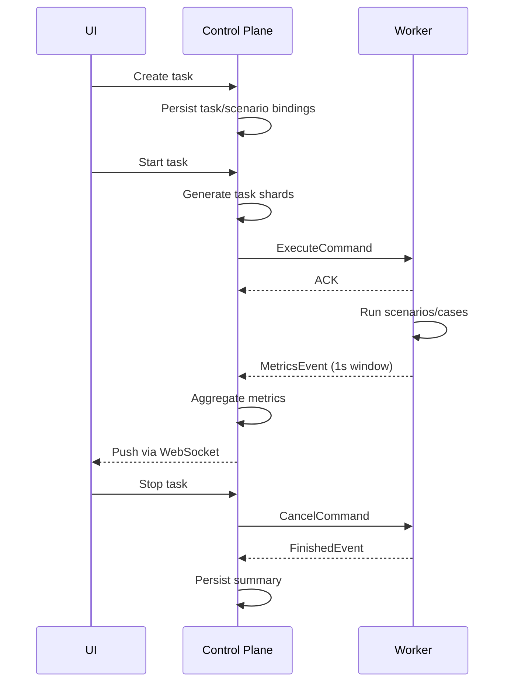

# Distributed Load Testing Engine Design

## 1. Background

The current project uses Locust as the execution engine. This is suitable for early validation, but it limits control over:

- Distributed scheduling
- Scenario orchestration
- Metrics aggregation
- Runtime extensibility
- Protocol abstraction

The next phase is to keep the existing FastAPI-based management plane and replace the Locust-based engine with a self-developed distributed load testing engine.

## 2. Goals

The new engine should support:

- One task containing multiple scenarios
- Horizontal scaling through multiple workers
- Centralized task orchestration
- Real-time metrics aggregation and streaming
- Extensible protocol execution
- Controlled runtime for extract/assert/script/context features

## 3. High-Level Architecture



### 3.1 Control Plane Responsibilities

- Manage tasks, scenarios, cases, and workers
- Split tasks into executable shards
- Dispatch shards to workers
- Aggregate metrics from all workers
- Maintain task and shard state machines
- Push runtime status to frontend clients

### 3.2 Worker Responsibilities

- Register to the control plane
- Receive and acknowledge task shards
- Execute scenarios locally
- Aggregate metrics locally and report periodically
- Send heartbeat and lifecycle events
- Stop, recover, or fail tasks safely

## 4. Core Domain Model

### 4.1 Task

Represents a load test execution definition.

Key fields:

- `name`
- `project_id`
- `host`
- `users`
- `spawn_rate`
- `duration`
- `status`

### 4.2 TaskScenario

Represents the relationship between a task and scenarios.

Key fields:

- `task_id`
- `scenario_id`
- `scenario`
- `order`
- `weight`
- `target_users`

### 4.3 Scenario

Represents a reusable business flow. A scenario contains multiple cases.

### 4.4 Case

Represents an executable request step with:

- protocol
- request definition
- extraction rules
- assertions
- pre/post hooks

## 5. Execution Model

Two execution strategies should be supported in the first few versions:

### 5.1 Sequential Strategy

Scenarios run in a defined order.

Suitable for:

- business-chain pressure tests
- end-to-end workflows
- stateful user journeys

### 5.2 Weighted Strategy

Scenarios run by weight or traffic ratio.

Suitable for:

- mixed traffic simulation
- production-like traffic distribution

## 6. Suggested Project Structure

Create a new engine package instead of modifying the current `engine/` incrementally:

```text
engine_v2/
  controller/
    scheduler.py
    dispatcher.py
    worker_registry.py
    aggregator.py
    state_machine.py
  worker/
    agent.py
    executor.py
    heartbeat.py
    local_metrics.py
  runtime/
    task_runner.py
    scenario_runner.py
    case_runner.py
    context.py
    extractor.py
    assertion.py
    script_sandbox.py
  protocol/
    http_client.py
    ws_client.py
    tcp_client.py
  contracts/
    commands.py
    events.py
    metrics.py
```

## 7. Module Design

### 7.1 `worker_registry`

Responsibilities:

- Track online workers
- Store capacity, tags, version, heartbeat time
- Mark workers as `ONLINE`, `BUSY`, `DEGRADED`, or `OFFLINE`

### 7.2 `scheduler`

Responsibilities:

- Select available workers
- Split a task into shards
- Balance based on users, capacity, tags, and health

### 7.3 `dispatcher`

Responsibilities:

- Deliver commands to workers
- Handle ACK and timeout
- Re-dispatch when needed

### 7.4 `task_runner`

Worker-side task entry point.

Responsibilities:

- Initialize runtime resources
- Start scenario runners
- Coordinate task lifecycle

### 7.5 `scenario_runner`

Responsibilities:

- Execute scenario cases in configured order or strategy
- Manage scenario-scoped variable context

### 7.6 `case_runner`

Responsibilities:

- Execute a single request step
- Trigger extraction, assertion, and context updates

### 7.7 `local_metrics`

Responsibilities:

- Aggregate request data by time window
- Reduce reporting volume to the control plane

### 7.8 `aggregator`

Responsibilities:

- Merge worker-level metrics into task-level metrics
- Produce frontend-friendly runtime snapshots

## 8. Communication Design

Use long-lived worker connections. WebSocket is a good first-phase choice because it is simple to integrate with the current FastAPI stack.

### 8.1 Command Types

- `register_worker`
- `heartbeat`
- `execute_task`
- `cancel_task`
- `scale_task`

### 8.2 Event Types

- `worker_registered`
- `task_ack`
- `task_started`
- `task_progress`
- `task_metrics`
- `task_finished`
- `task_failed`

### 8.3 Message Requirements

Each command/event should include:

- `message_id`
- `timestamp`
- `worker_id`
- `task_id`
- `shard_id`
- `payload`

Commands should be idempotent through `message_id` or `command_id`.

## 9. Data Flow



## 10. State Machine

### 10.1 Task State

`PENDING -> DISPATCHING -> RUNNING -> COMPLETED | FAILED | CANCELED`

### 10.2 Shard State

`PENDING -> ASSIGNED -> ACKED -> RUNNING -> COMPLETED | FAILED | LOST | CANCELED`

### 10.3 Worker State

`ONLINE | BUSY | DEGRADED | OFFLINE`

## 11. Database Changes

Existing useful tables:

- `tasks`
- `task_scenarios`
- `scenarios`
- `scenario_cases`
- `cases`

Recommended new tables:

### 11.1 `workers`

Fields:

- `worker_id`
- `hostname`
- `ip`
- `status`
- `capacity`
- `tags`
- `last_heartbeat_at`
- `version`

### 11.2 `task_shards`

Fields:

- `id`
- `task_id`
- `shard_no`
- `worker_id`
- `status`
- `planned_users`
- `actual_users`
- `started_at`
- `finished_at`

### 11.3 `task_runs`

Fields:

- `id`
- `task_id`
- `status`
- `started_at`
- `finished_at`
- `runtime_seconds`
- `summary_json`

### 11.4 `task_metrics_second`

Fields:

- `task_id`
- `shard_id`
- `ts`
- `rps`
- `success_count`
- `fail_count`
- `avg_rt`
- `p95`
- `p99`

### 11.5 `worker_events`

Fields:

- `worker_id`
- `event_type`
- `payload`
- `created_at`

## 12. Runtime Design

### 12.1 Protocol Layer

Phase 1 should prioritize HTTP.

Recommended implementation:

- `httpx.AsyncClient`
- connection pooling
- keep-alive reuse
- timeout control

Later phases can add:

- WebSocket
- TCP

### 12.2 Context Model

Context should be layered:

- task context
- scenario context
- case runtime context

Use cases:

- variable rendering
- extracted value storage
- chained requests

### 12.3 Assertion and Extraction

Recommended order:

1. execute request
2. parse response
3. extract variables
4. perform assertions
5. update metrics

### 12.4 Script Capability

Phase 1 should not execute arbitrary Python scripts directly.

Safer alternatives:

- template expressions
- limited sandbox DSL
- whitelisted built-in helpers

## 13. Metrics Design

Worker-side metrics should be aggregated locally in fixed windows, usually 1 second.

Suggested metrics:

- total requests
- success count
- failure count
- average response time
- min/max response time
- p50 / p95 / p99
- current active users
- per-scenario throughput
- per-case error distribution

Avoid reporting every request event back to the control plane.

## 14. Failure Handling

### 14.1 Worker Heartbeat Timeout

If heartbeat timeout is reached:

- mark worker as `OFFLINE`
- mark related shards as `LOST`
- decide whether to re-dispatch or fail task

### 14.2 Control Plane Restart

Workers should continue running for in-flight shards and attempt to reconnect.

### 14.3 Command Retry

Commands must support retry without duplicate execution.

## 15. Security Considerations

- Do not log bearer tokens or raw credentials
- Worker authentication should use signed registration credentials
- Runtime script execution must be sandboxed or disabled initially
- Internal worker channels should be authenticated
- Metrics payload should be bounded in size

## 16. Implementation Milestones

### M1: Single-Node Self-Developed Executor

- Replace Locust with self-developed HTTP execution
- Support task -> scenarios -> cases runtime
- Support basic metrics collection

### M2: Distributed Worker MVP

- Worker registration
- Heartbeat
- Task shard dispatch
- Metrics reporting

### M3: Realtime and Control

- Frontend real-time streaming
- Stop/scale operations
- Shard state visualization

### M4: Advanced Runtime

- extraction DSL
- assertion DSL
- safer script support
- WS/TCP protocols

## 17. Phase 1 Development Checklist

1. Stabilize `Task` and `TaskScenario` model design
2. Create `workers`, `task_shards`, and `task_runs` tables
3. Add worker registration and heartbeat API/channel
4. Implement WebSocket control channel
5. Build async HTTP executor
6. Implement scenario runtime and context propagation
7. Implement worker local metrics aggregation
8. Implement control-plane metrics aggregator
9. Add `/task/run`, `/task/stop`, `/task/status`
10. Add integration tests for distributed execution flow

## 18. Migration Strategy

Do not replace the old engine in place immediately.

Recommended approach:

1. Keep existing `app/` as the control plane
2. Introduce `engine_v2/`
3. Build and validate the self-developed engine in parallel
4. Switch task execution endpoints to `engine_v2`
5. Remove Locust-related code only after full replacement

## 19. Open Questions

Questions to settle before implementation:

1. Is Redis acceptable as the coordination layer?
2. Should worker communication use WebSocket or gRPC?
3. What is the expected worker scale in phase 1?
4. Do we need multi-tenant isolation in the first version?
5. Should metrics detail be stored long-term or only summarized?
